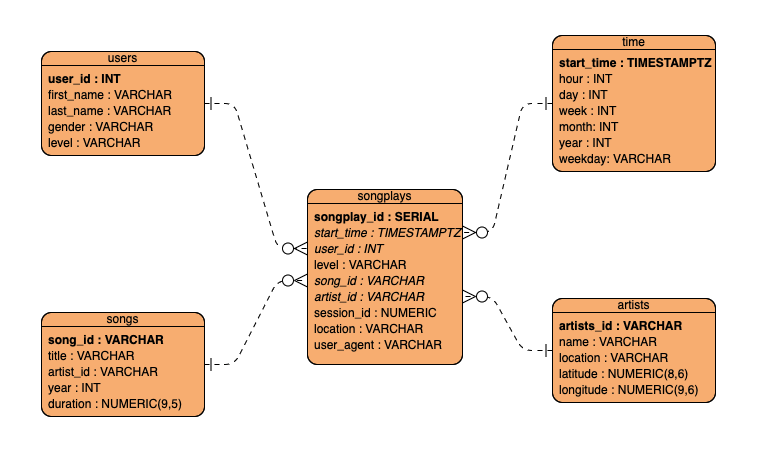

# Sparkify Data Lake

## Introduction
A music streaming startup, Sparkify, has grown their user base and song database even more and wants to move their data warehouse to a data lake. Their data resides in S3, in a directory of JSON logs on user activity on the app, as well as a directory with JSON metadata on the songs in their app.

## Project and Structure

This project aims to provide dimensional modeling based on Sparkify company. They intend to perform analytics to understand the listening habits of their users. Ideally, they want to know which users are playing certain songs and further gather all relevant metadata about the track played. Currently, all their data is stored in Amazon S3, and we will first load the data into Spark for transformation and then load the transformed data back into the S3.



```
root/
├── README.md              Documentation of the project
├── dwh.cfg                Configuration file for setting up S3 sources/destinations & AWS credentials
├── etl.py                 Python script to load data from S3 and load it back into the data lake
└── Discovery.ipynb        Notebook script to discovery phase and create step-by-step
```

## Make it ready
Inside this project exists a config file named `dl.cfg` where you will store the parameters. A key and secret are expected to connect to AWS servers and the path where the files are stored. 

```json
[AWS]
AWS_ACCESS_KEY_ID=
AWS_SECRET_ACCESS_KEY=

[S3]
INPUT_PATH=
OUTPUT_PATH=
```

## How to execute
Open up a terminal and execute the command below
```shell
$ python etl.py
```
If everything goes well after a few minutes we will be able to see the result in a parquet format in the output path.
